<!--
  ╔══════════════════════════════════════════════════════════════════════╗
  ║  GitHub Profile — Muhammad-Rehan152005                              ║
  ║  Generated with the GitHub Profile Master Prompt                    ║
  ╚══════════════════════════════════════════════════════════════════════╝

  MANUAL CHECKLIST (do these once):
  1. Upload dark.svg and light.svg to THIS repo (root of username/username)
  2. Create GitHub classic token: Settings → Developer settings →
     Tokens (classic) → Generate new (classic) → repo scope → No expiry
     COPY IT IMMEDIATELY — you will never see it again!
     DO NOT paste it anywhere public!
  3. Fork https://github.com/anuraghazra/github-readme-stats
  4. Go to vercel.com → sign up with GitHub → Hobby (free) →
     Add New Project → import your fork
  5. Add env variable: PAT_1 = <your token> → Deploy
  6. After deploy, copy your Vercel URL (e.g. https://my-stats.vercel.app)
     and replace YOUR_VERCEL_URL in this README below.
  7. Repo Settings → Actions → General → Workflow permissions →
     set to "Read and write permissions" (this is the REPO settings,
     not your account settings)
  8. Run the snake workflow manually once (Actions tab → Generate
     Contribution Snake → Run workflow), then add the <picture> block below.
-->

<!-- ══════════════════ BANNER ══════════════════ -->
<picture>
  <source media="(prefers-color-scheme: dark)"  srcset="dark.svg">
  <source media="(prefers-color-scheme: light)" srcset="light.svg">
  
</picture>

 

<!-- ══════════════════ BADGES ══════════════════ -->

  <!-- LinkedIn — uses brand blue #0A66C2 because LinkedIn logo silently
       disappears on any other background colour (known shields.io bug) -->
  
  &nbsp;&nbsp;

  <!-- Fiverr -->
  
  &nbsp;&nbsp;

  <!-- Gmail — recolours fine -->
  
  &nbsp;&nbsp;

  <!-- Instagram (if you add it later) -->
  <!-- 
  &nbsp;&nbsp; -->

  <!-- Profile views -->
  

 

<!-- ══════════════════ STATS CARDS ══════════════════ -->
<!--
  IMPORTANT: Replace YOUR_VERCEL_URL with your actual Vercel deployment URL.
  Example: https://github-readme-stats-fork.vercel.app
  The public anuraghazra instance is rate-limited and unreliable.
  Self-host your own — it takes ~15 minutes and is free on Vercel.
  See the checklist at the top of this file.
-->

<!-- Streak card — full width -->

  

<!-- Stats + top languages side by side -->

  
  <!-- hide_rank=true: the rank badge is weighted by stars and is misleading
       for newer accounts (a repo with 0 stars but 1000 commits ranks poorly).
       Hiding it keeps the focus on actual activity metrics. -->
  

 

<!-- ══════════════════ SNAKE ══════════════════ -->
<!--
  Only uncomment this block AFTER the snake GitHub Action has run
  successfully at least once and the "output" branch exists.
  The output branch does not exist before the Action runs green.
-->
<!--
<picture>
  <source
    media="(prefers-color-scheme: dark)"
    srcset="https://raw.githubusercontent.com/Muhammad-Rehan152005/Muhammad-Rehan152005/output/snake-dark.svg"
  >
  <source
    media="(prefers-color-scheme: light)"
    srcset="https://raw.githubusercontent.com/Muhammad-Rehan152005/Muhammad-Rehan152005/output/snake-light.svg"
  >
  
</picture>
-->

 

<!-- ══════════════════ TECH STACK ══════════════════ -->
<h3 align="center">🛠️ Tech Stack</h3>

  <!-- Mobile -->
  
  
  <!-- Frontend -->
  
  
  <!-- Backend -->
  
  
  
  <!-- Database -->
  
  
  
  <!-- DevOps -->
  
  
  <!-- Tools -->
  
  
  

 

  <i>Building clean, scalable software — one commit at a time.</i>

